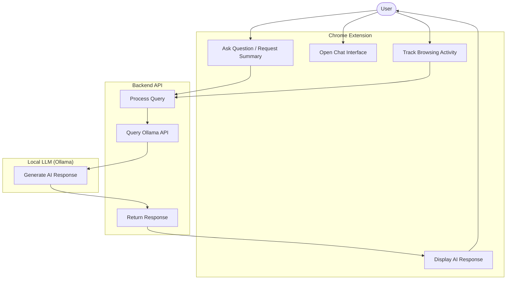

# Use cases
The following shows the main flows for the project

```mermaid
graph TD
    User([User])
    subgraph Chrome_Extension ["Chrome Extension"]
        CE1["Track Browsing Activity"]
        CE2["Open Chat Interface"]
        CE3["Ask Question / Request Summary"]
        CE4["Display AI Response"]
    end

    subgraph Backend_API ["Backend API"]
        BE1["Process Query"]
        BE2["Query Ollama API"]
        BE3["Return Response"]
    end

    subgraph Ollama ["Local LLM (Ollama)"]
        OA1["Generate AI Response"]
    end

    User --> CE1
    User --> CE2
    User --> CE3
    CE4 --> User

    CE3 --> BE1
    CE1 --> BE1
    BE1 --> BE2
    BE2 --> OA1
    OA1 --> BE3
    BE3 --> CE4
```
